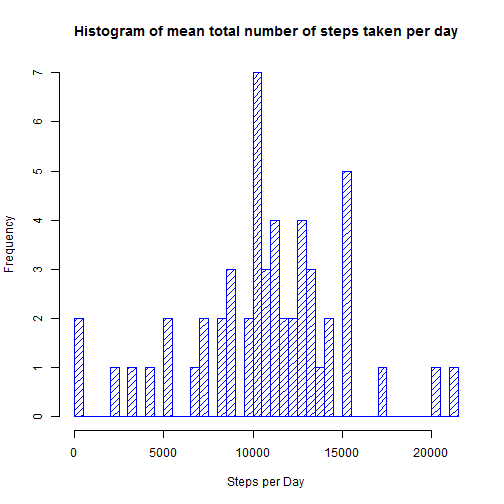
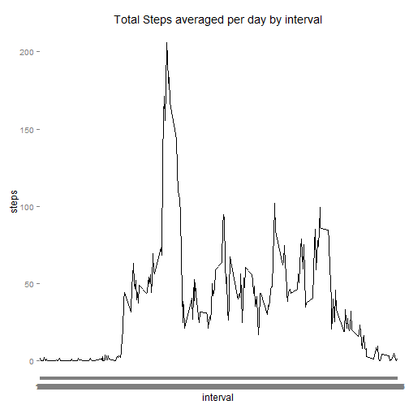
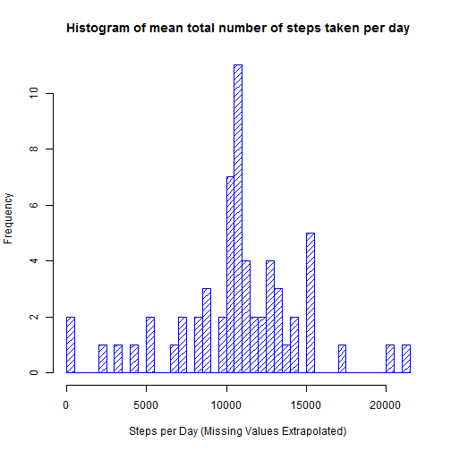
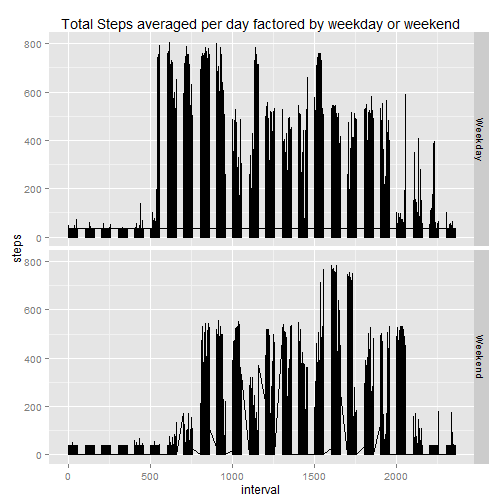

It is now possible to collect a large amount of data about personal movement using activity monitoring devices such as a Fitbit, Nike Fuelband, or Jawbone Up. These type of devices are part of the “quantified self” movement – a group of enthusiasts who take measurements about themselves regularly to improve their health, to find patterns in their behavior, or because they are tech geeks. But these data remain under-utilized both because the raw data are hard to obtain and there is a lack of statistical methods and software for processing and interpreting the data.

This assignment makes use of data from a personal activity monitoring device. This device collects data at 5 minute intervals through out the day. The data consists of two months of data from an anonymous individual collected during the months of October and November, 2012 and include the number of steps taken in 5 minute intervals each day.

Step 1: Loading and pre-processing the data. 

*NOTE:* At this point in the analysis, no pre-processing of the data has been undertaken.  I simply load the data.


```r
activity <- read.csv("activity.csv")
```

*What is the mean total number of steps taken per day?*


```r
TotalStepsDaily <- aggregate(steps ~ date, data=activity, FUN=sum, na.rm=FALSE) 
hist(TotalStepsDaily$steps, 
     main="Histogram of mean total number of steps taken per day",
     xlab="Steps per Day",
     density=16,
     breaks= 53,
     col="blue")
```

 

```r
MeanSteps <- format(mean(TotalStepsDaily$steps), digits=7)
MedianSteps <- median(TotalStepsDaily$steps)
```

The median number of steps take per day is 10765 and <br>
the mean number of steps taken per day is 10766.19.

*What is the average daily activity pattern?*


```r
##install.packages("ggplot2")
library(chron)
```

```
## Warning: package 'chron' was built under R version 3.1.2
```

```r
library(ggplot2)
```

```
## Warning: package 'ggplot2' was built under R version 3.1.2
```

```r
StepsInterval <- aggregate(steps ~ interval, data=activity, FUN=mean, na.rm=TRUE) 
ggplot(StepsInterval, aes(interval, steps)) + geom_line() + 
        scale_x_discrete(labels = format(StepsInterval$interval, format="%h")) +
        labs(title = "Total Steps averaged per day by interval")
```

 

```r
MostActiveInterval <- StepsInterval[which.max(StepsInterval$steps), 1]
MostSteps <- format(StepsInterval[which.max(StepsInterval$steps), 2], digits=3)
```

*Which 5-minute interval, on average across all the days in the dataset, contains the maximum number of steps?* <br>
Is Interval 835 with 206 steps.
<br>

Note that there are a number of days/intervals where there are missing values (coded as NA). The presence of missing days may introduce bias into some calculations or summaries of the data.

*Calculate and report the total number of missing values in the dataset (i.e. the total number of rows with NAs)*


```r
MissingValuesCount <- sum(is.na(activity$steps))
```

The total number of missing values in the dataset is 2304. <br>

Devise a strategy for filling in all of the missing values in the dataset. The strategy does not need to be sophisticated. For example, you could use the mean/median for that day, or the mean for that 5-minute interval, etc.

Create a new dataset that is equal to the original dataset but with the missing data filled in.

*Make a histogram of the total number of steps taken each day and Calculate and report the mean and median total number of steps taken per day. *


```r
NoNA <- activity
NoNA[is.na(NoNA), 1] <- round(as.numeric(MeanSteps)/288)
TotalStepsDaily_NoNA <- aggregate(steps ~ date, data=NoNA, FUN=sum, na.rm=FALSE) 
hist(TotalStepsDaily_NoNA$steps, 
     main="Histogram of mean total number of steps taken per day",
     xlab="Steps per Day (Missing Values Extrapolated)",
     density=16,
     breaks=61,
     col="blue")
```

 

```r
MeanSteps_NoNA <- format(mean(TotalStepsDaily_NoNA$steps), digits=7)
MedianSteps_NoNA <- format(median(TotalStepsDaily_NoNA$steps), digits=5)
```

I replaced missing values with the average number of steps per interval calculated as the average number of steps per day divided by 288 intervals per day.

The median number of steps taken per day (with extrapolated values added) is 10656 and <br>
the mean number of steps taken per day is 10751.74.

*Do these values differ from the estimates from the first part of the assignment? *

With missing values ignored:  Mean Steps is 10766.19 and Median Steps is 10765. <br>
With missing values generated: Mean Steps is 10751.74 and Median Steps is 10656.


#Are there differences in activity patterns between weekdays and weekends?#

For this part the weekdays() function may be of some help here. Use the dataset with the filled-in missing values for this part.

Create a new factor variable in the dataset with two levels -- "weekday" and "weekend" indicating whether a given date is a weekday or weekend day.


```r
MedianSteps_NoNA <- format(median(TotalStepsDaily_NoNA$steps), digits=5)
NoNA$DOW <- is.weekend(NoNA$date)
NoNA$DOW <- factor(NoNA$DOW, labels=c("Weekday", "Weekend"))
```


*Make a panel plot containing a time series plot (i.e. type = "l") of the 5-minute interval (x-axis) and the average number of steps taken, averaged across all weekday days or weekend days (y-axis). *


```r
P <- ggplot(NoNA, aes(interval, steps)) + geom_line()
P +  facet_grid(DOW ~ .) + 
        labs(title = "Total Steps averaged per day factored by weekday or weekend")
```

 
